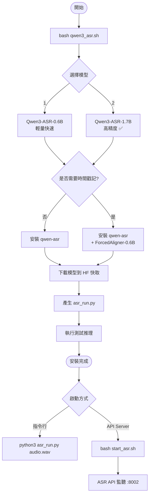
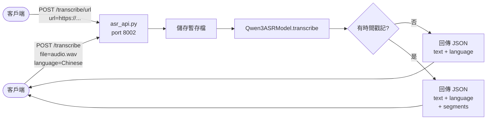
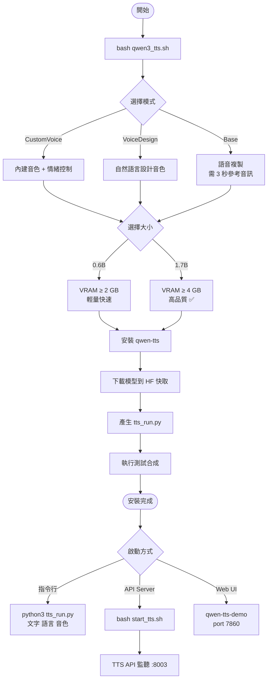
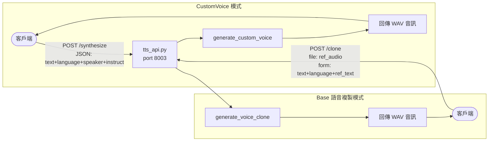
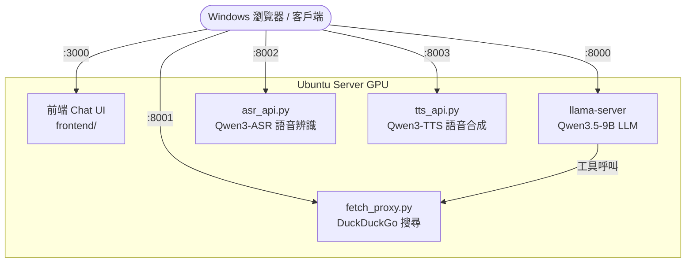

# Qwen3 ASR & TTS 使用指南

本文件說明 Qwen3-ASR（語音辨識）與 Qwen3-TTS（文字轉語音）兩個模型的架構、安裝流程與 API 使用方式。

---

## Qwen3-ASR 語音辨識

### 模型說明

| 項目 | 內容 |
|------|------|
| 模型 | Qwen3-ASR-0.6B / Qwen3-ASR-1.7B |
| 架構 | Transformer 多模態（基於 Qwen3-Omni） |
| 支援語言 | 30 種語言 + 22 種中文方言 |
| 輸入格式 | WAV、MP3、URL、Base64、numpy array |
| 最長音訊 | 5 分鐘（搭配 ForcedAligner） |
| 特色 | 自動語言偵測、批次推理、歌聲辨識 |
| VRAM | 0.6B ≥ 2 GB / 1.7B ≥ 4 GB |

### 支援語言

```
中文(普通話) English  日本語  한국어  Deutsch  Français
Español  Português  Русский  Italiano  Arabic  Hindi
Indonesian  Vietnamese  Thai  Turkish  Malay  Dutch
Swedish  Danish  Finnish  Polish  Czech  Filipino
Persian  Greek  Hungarian  Macedonian  Romanian
粵語 + 22 種中文方言
```

### 安裝與啟動流程



### API 流程



### API 端點

| 方法 | 路徑 | 說明 |
|------|------|------|
| `GET` | `/health` | 健康檢查 |
| `POST` | `/transcribe` | 上傳音訊檔案轉錄 |
| `POST` | `/transcribe/url` | 透過 URL 轉錄 |

### 呼叫範例

```bash
# 上傳音訊檔案（自動偵測語言）
curl -X POST http://192.168.80.224:8002/transcribe \
  -F "file=@audio.wav"

# 指定語言（更快更準）
curl -X POST http://192.168.80.224:8002/transcribe \
  -F "file=@audio.wav" \
  -F "language=Chinese"

# 啟用時間戳記
curl -X POST http://192.168.80.224:8002/transcribe \
  -F "file=@audio.wav" \
  -F "language=Chinese" \
  -F "timestamps=true"

# 透過 URL
curl -X POST http://192.168.80.224:8002/transcribe/url \
  -F "url=https://example.com/audio.wav" \
  -F "language=English"
```

### 回傳格式

```json
// 一般轉錄
{
  "text": "甚至出現交易幾乎停滯的情況。",
  "language": "Chinese"
}

// 含時間戳記
{
  "text": "甚至出現交易幾乎停滯的情況。",
  "language": "Chinese",
  "segments": [
    { "text": "甚至", "start": 0.12, "end": 0.48 },
    { "text": "出現", "start": 0.50, "end": 0.86 }
  ]
}
```

### 環境變數

```bash
ASR_MODEL=Qwen/Qwen3-ASR-1.7B    # 模型名稱
ASR_TIMESTAMPS=false               # 啟用時間戳記（需先安裝 ForcedAligner）
ASR_PORT=8002                      # 監聽 Port

# 範例：切換為 0.6B 並啟用時間戳記
ASR_MODEL=Qwen/Qwen3-ASR-0.6B ASR_TIMESTAMPS=true bash start_asr.sh
```

---

## Qwen3-TTS 文字轉語音

### 模型說明

| 項目 | 內容 |
|------|------|
| 模型 | 0.6B / 1.7B，三種模式 |
| 架構 | 離散多碼本語言模型（non-DiT） |
| 支援語言 | 10 種（中英日韓德法俄葡西義） |
| 輸出格式 | WAV |
| 端到端延遲 | 97ms（串流模式） |
| VRAM | 0.6B ≥ 2 GB / 1.7B ≥ 4 GB |

### 三種模式比較

| 模式 | 模型後綴 | 說明 | 適合情境 |
|------|---------|------|---------|
| **CustomVoice** | `-CustomVoice` | 9 種精選內建音色 + 情緒指令控制 | 產品配音、助理語音 |
| **VoiceDesign** | `-VoiceDesign` | 用自然語言描述設計音色 | 客製化音色開發 |
| **Base** | `-Base` | 語音複製（3 秒參考音訊） | 複製特定人聲 |

### 內建音色（CustomVoice / VoiceDesign）

| 音色 | 語言 | 特色 |
|------|------|------|
| `Vivian` | 中文 | 明亮略帶個性的年輕女聲 |
| `Serena` | 中文 | 溫柔親切的年輕女聲 |
| `Uncle_Fu` | 中文 | 成熟男聲，低沉醇厚 |
| `Dylan` | 中文 | 北京青年男聲，清晰 |
| `Eric` | 中文 | 成都男聲，帶磁性 |
| `Ryan` | 英文 | 活力男聲，節奏感強 |
| `Aiden` | 英文 | 陽光美式男聲，清澈中頻 |
| `Ono_Anna` | 日文 | 活潑日本女聲，輕盈音色 |
| `Sohee` | 韓文 | 溫暖韓國女聲，情感豐富 |

### 安裝與啟動流程



### API 流程



### API 端點

| 方法 | 路徑 | 說明 |
|------|------|------|
| `GET` | `/health` | 健康檢查 |
| `GET` | `/speakers` | 列出可用音色 |
| `GET` | `/languages` | 列出可用語言 |
| `POST` | `/synthesize` | 文字轉語音（CustomVoice / VoiceDesign 模式） |
| `POST` | `/clone` | 語音複製（Base 模式） |

### 呼叫範例

```bash
# 查詢可用音色
curl http://192.168.80.224:8003/speakers

# 合成語音（CustomVoice）
curl -X POST http://192.168.80.224:8003/synthesize \
  -H "Content-Type: application/json" \
  -d '{"text":"你好，歡迎使用語音合成","language":"Chinese","speaker":"Vivian"}' \
  --output output.wav

# 加入情緒指令
curl -X POST http://192.168.80.224:8003/synthesize \
  -H "Content-Type: application/json" \
  -d '{"text":"Hello world","language":"English","speaker":"Ryan","instruct":"Very excited tone"}' \
  --output output.wav

# 語音複製（需提供參考音訊）
curl -X POST http://192.168.80.224:8003/clone \
  -F "text=你好，這是複製的聲音" \
  -F "language=Chinese" \
  -F "ref_text=參考音訊的文字內容" \
  -F "ref_audio=@ref.wav" \
  --output output.wav

# 語音複製（使用 URL）
curl -X POST http://192.168.80.224:8003/clone \
  -F "text=Hello" \
  -F "language=English" \
  -F "ref_url=https://example.com/ref.wav" \
  --output output.wav
```

### 環境變數

```bash
TTS_MODEL=Qwen/Qwen3-TTS-12Hz-1.7B-CustomVoice   # 模型名稱
TTS_MODE=custom                                     # 模式：custom 或 base
TTS_PORT=8003                                       # 監聽 Port

# 範例：切換為 Base 語音複製模式
TTS_MODEL=Qwen/Qwen3-TTS-12Hz-1.7B-Base TTS_MODE=base bash start_tts.sh
```

---

## 完整服務架構



## 啟動順序

```bash
# LLM + 搜尋（主服務）
tmux new-session -d -s llm 'bash ~/qwen-api/start.sh'

# OpenClaw agent
tmux new-session -d -s openclaw 'bash ~/qwen-api/start_openclaw.sh'

# ASR（需先執行 qwen3_asr.sh 安裝）
tmux new-session -d -s asr 'bash ~/qwen-api/start_asr.sh'

# TTS（需先執行 qwen3_tts.sh 安裝）
tmux new-session -d -s tts 'bash ~/qwen-api/start_tts.sh'

# 查看所有服務
tmux ls
```

> **VRAM 注意**：同時跑 LLM（~7-9 GB）+ ASR（~4 GB）+ TTS（~4 GB）會超過 RTX 3060 12 GB。
> 建議依需求按需啟動，用 `bash release_vram.sh` 釋放後再切換。
