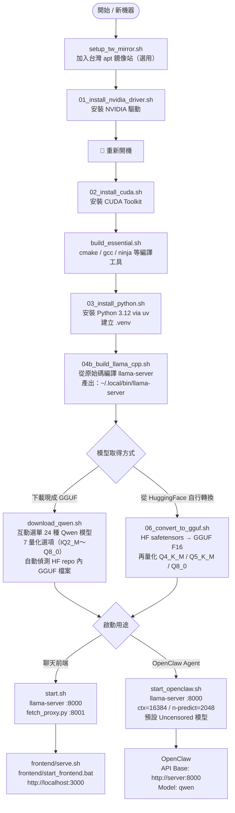
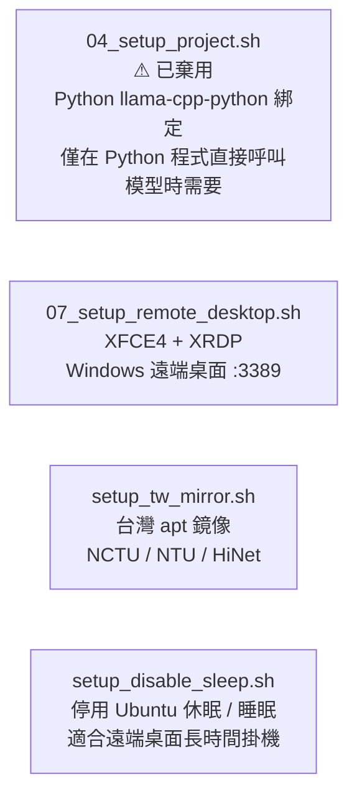

# Scripts Flowchart

## 安裝流程

---

## 選用腳本

---

## 腳本一覽

| 腳本 | 功能 | 必要 |
|------|------|------|
| `setup_tw_mirror.sh` | 加入台灣 apt 鏡像（NCTU / NTU / HiNet） | 選用 |
| `01_install_nvidia_driver.sh` | 安裝 NVIDIA 驅動 → 需重開機 | ✅ |
| `02_install_cuda.sh` | 安裝 CUDA Toolkit | ✅ |
| `build_essential.sh` | 安裝 cmake、gcc 等編譯工具 | ✅ |
| `03_install_python.sh` | 安裝 Python 3.12 via uv、建立 `.venv` | ✅ |
| `04_setup_project.sh` | Python llama-cpp-python 綁定 ⚠ 已棄用 | 選用 |
| `04b_build_llama_cpp.sh` | 從原始碼編譯 llama-server（CUDA） | ✅ |
| `05_download_model.sh` | 下載現成 GGUF 模型（舊版，5 選項） | 選用 |
| `download_qwen.sh` | 互動選單下載任意 Qwen GGUF（24 模型 × 7 量化） | ✅ |
| `06_convert_to_gguf.sh` | HF safetensors → GGUF + 量化 | 選用 |
| `07_setup_remote_desktop.sh` | XFCE4 + XRDP 遠端桌面 | 選用 |
| `setup_tw_mirror.sh` | 加入台灣 apt 鏡像（NCTU / NTU / HiNet） | 選用 |
| `setup_disable_sleep.sh` | 停用 Ubuntu 休眠 / 睡眠（適合遠端桌面） | 選用 |
| `start.sh` | 啟動聊天 API（port 8000 + 8001） | 執行時 |
| `start_openclaw.sh` | 啟動 OpenClaw 專用 API（port 8000） | 執行時 |
| `frontend/serve.sh` | 啟動聊天前端（port 3000，Linux） | 執行時 |
| `frontend/start_frontend.bat` | 啟動聊天前端（port 3000，Windows） | 執行時 |
